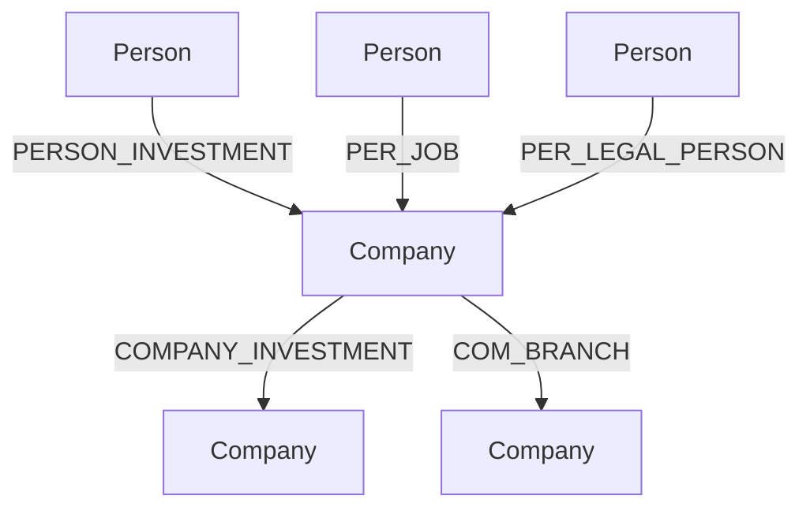

# Neo4j 图数据结构说明文档

## 1. 节点类型（Node Labels）

### 1.1 公司节点（Company）

- **标签**：`Company`
- **属性**：
  - `name`：公司名称（字符串）
  - `credit_code`：统一社会信用代码（18位数字和大写字母，唯一）
  - `company_id`：公司ID（唯一数字标识）
  - `reg_date`：注册日期（字符串，格式如"2012-05-16"）
  - `reg_capital`：注册资本（浮点数，单位万元）

#### 示例
```json
{
  "name": "江苏科技有限公司",
  "credit_code": "A1B2C3D4E5F6G7H8I9",
  "company_id": 1,
  "reg_date": "2012-05-16",
  "reg_capital": 5000.00
}
```

---

### 1.2 人员节点（Person）

- **标签**：`Person`
- **属性**：
  - `name`：姓名（字符串）
  - `person_id`：人员ID（唯一数字标识）
  - `age`：年龄（整数，18-70）
  - `gender`：性别（"男" 或 "女"）

#### 示例
```json
{
  "name": "张伟",
  "person_id": 101,
  "age": 42,
  "gender": "男"
}
```

---

## 2. 关系类型（Relationship Types）

### 2.1 企业投资关系（company_investment）

- **类型**：`COMPANY_INVESTMENT`
- **起点**：`Company`
- **终点**：`Company`
- **属性**：
  - `invest_rate`：投资比例（0-1之间的浮点数）
  - `invest_date`：投资日期（字符串，格式如"2015-08-20"）

#### 示例
```
(:Company {company_id: 1})-[:COMPANY_INVESTMENT {invest_rate: 0.35, invest_date: "2015-08-20"}]->(:Company {company_id: 2})
```

---

### 2.2 人员投资关系（person_investment）

- **类型**：`PERSON_INVESTMENT`
- **起点**：`Person`
- **终点**：`Company`
- **属性**：
  - `invest_rate`：投资比例（0-1之间的浮点数）
  - `invest_date`：投资日期（字符串）

#### 示例
```
(:Person {person_id: 101})-[:PERSON_INVESTMENT {invest_rate: 0.15, invest_date: "2018-03-12"}]->(:Company {company_id: 1})
```

---

### 2.3 分支机构关系（com_branch）

- **类型**：`COM_BRANCH`
- **起点**：`Company`（母公司）
- **终点**：`Company`（分公司）
- **属性**：无

#### 示例
```
(:Company {company_id: 1})-[:COM_BRANCH]->(:Company {company_id: 3})
```

---

### 2.4 任职关系（per_job）

- **类型**：`PER_JOB`
- **起点**：`Person`
- **终点**：`Company`
- **属性**：
  - `job_type`：职位类型（如"董事长"、"总经理"、"高管"、"监事"、"财务负责人"等）

#### 示例
```
(:Person {person_id: 102})-[:PER_JOB {job_type: "董事长"}]->(:Company {company_id: 1})
```

---

### 2.5 法人关系（per_legal_person）

- **类型**：`PER_LEGAL_PERSON`
- **起点**：`Person`
- **终点**：`Company`
- **属性**：
  - `job_type`：职位类型（固定为"法定代表人"）

#### 示例
```
(:Person {person_id: 103})-[:PER_LEGAL_PERSON {job_type: "法定代表人"}]->(:Company {company_id: 1})
```

---

## 3. 结构示意图



---

## 4. 典型子图示例

- 江苏科技有限公司（company_id: 1）由张伟（person_id: 101）投资15%，由李丽（person_id: 102）担任董事长，王强（person_id: 103）为法定代表人。
- 江苏科技有限公司投资了苏州贸易有限公司（company_id: 2）35%。
- 江苏科技有限公司有一个分支机构南京科技有限公司（company_id: 3）。

---

## 5. 业务规则说明

- 每个公司至少有1-3个投资关系（公司或人员投资）
- 约30%的公司有分支机构
- 每个公司有1-5个任职人员
- 每个公司有1个法人（法定代表人）

---

如需更详细的 Cypher 查询示例或数据导入样例，请随时补充需求！