# Mermaid关系图示例

本文档提供了各种企业知识图谱关系图的Mermaid代码示例，供大模型参考生成。

## 1. 投资关系图

### 个人投资公司
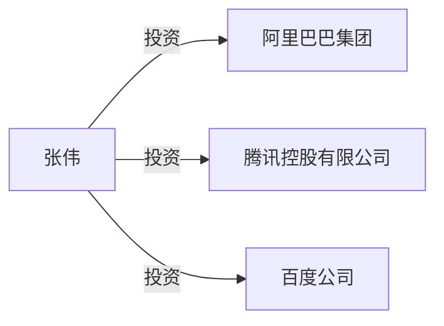

### 公司投资关系链
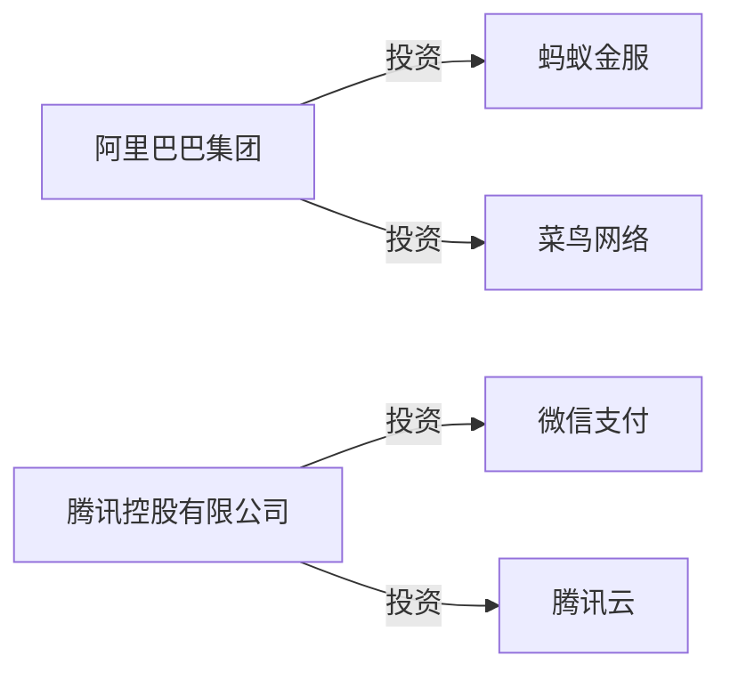

### 多层投资关系

## 2. 分支机构关系图

### 公司分支机构
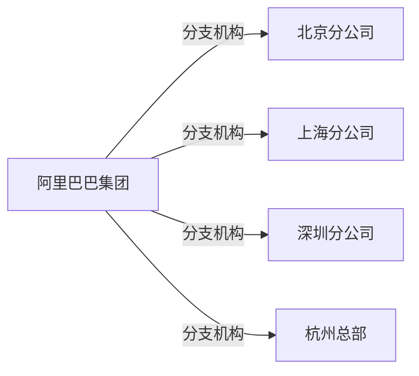

### 区域分布
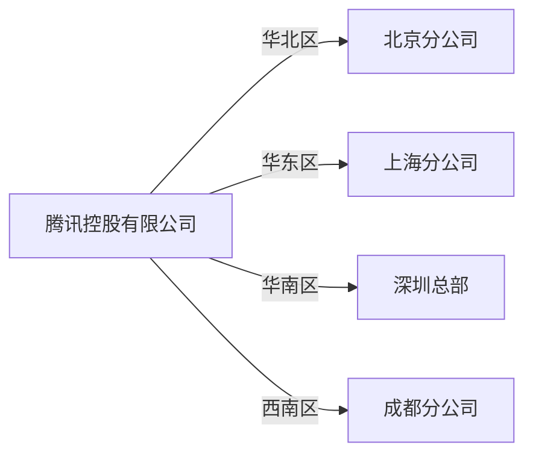

## 3. 人员关系图

### 公司高管
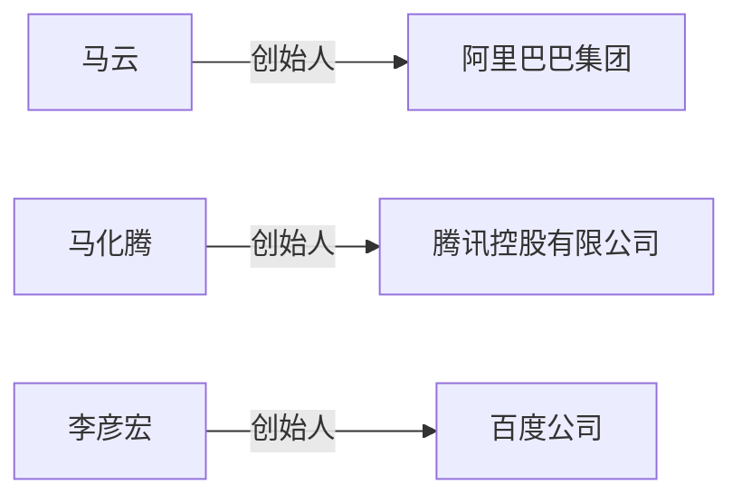

### 任职关系
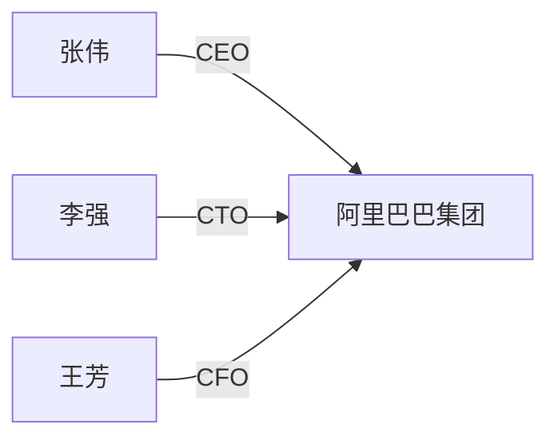

## 4. 合作关系图

### 战略合作
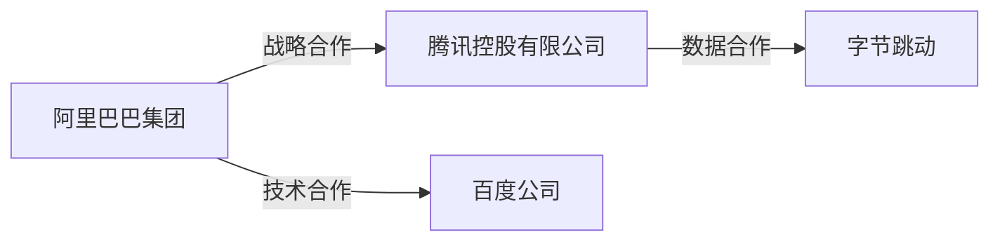

### 供应链关系
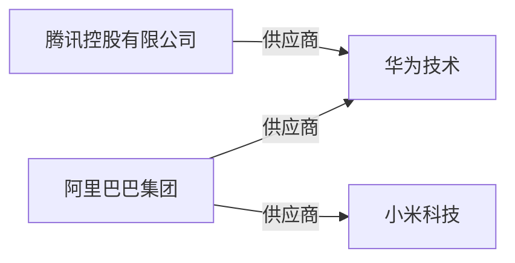

## 5. 复杂关系网络

### 多维度关系
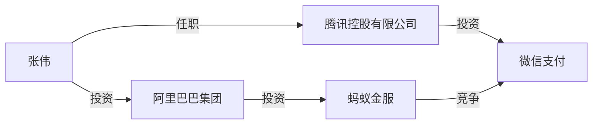

### 产业链关系
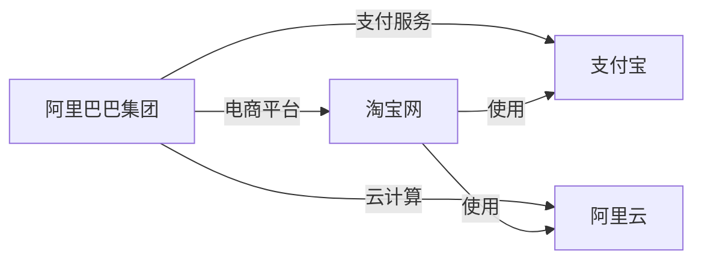

## 6. 时间线关系图

### 投资时间线
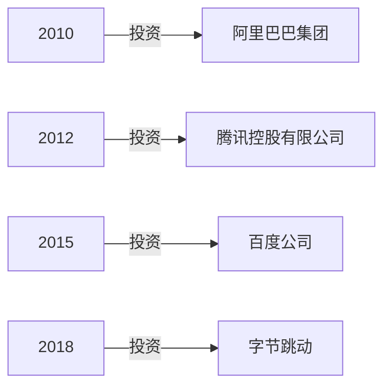

## 使用说明

1. **实体命名**：使用查询结果中的实际实体名称
2. **关系描述**：使用中文描述关系类型（投资、分支机构、任职等）
3. **图形方向**：使用 `graph LR`（从左到右）或 `graph TD`（从上到下）
4. **样式**：保持简洁，避免过于复杂的图形
5. **数量控制**：当关系过多时，选择最重要的关系进行展示

## 注意事项

- 只在实际存在关系时才生成图形
- 实体名称要准确，避免歧义
- 关系类型要清晰明确
- 图形布局要合理，避免交叉
- 当关系网络过于复杂时，可以分多个图形展示 